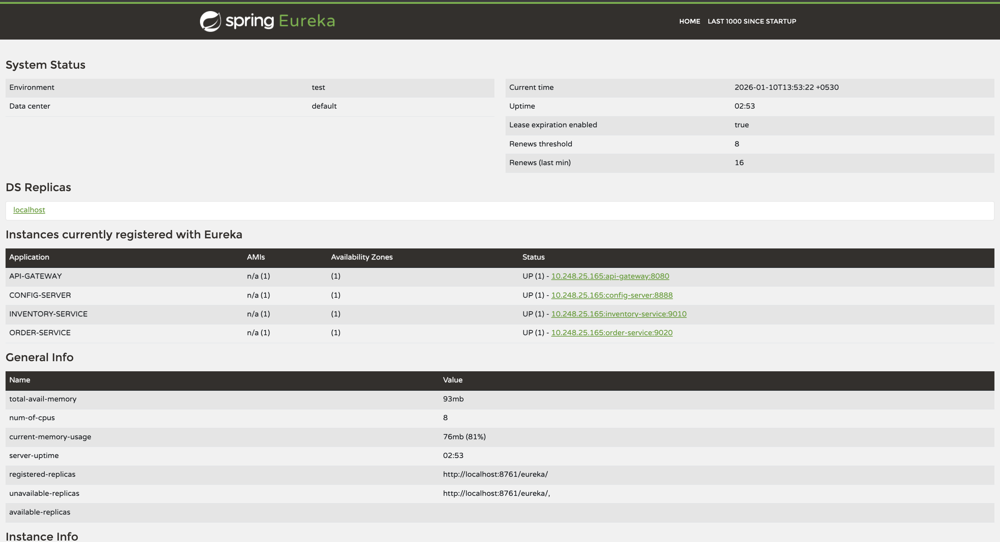
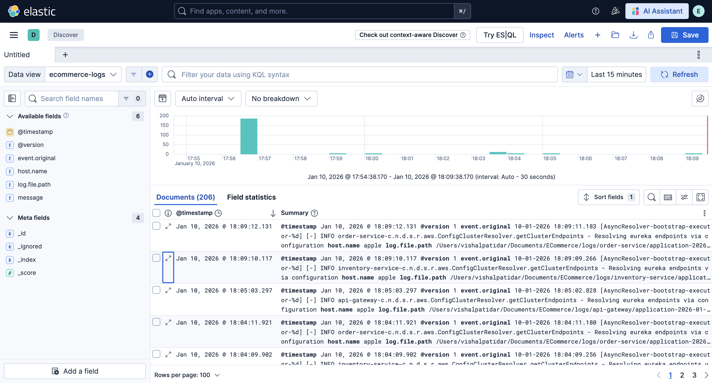

# ecommerce-microservices-kafka-docker-kubernetes

## 📌 Overview

A demo microservices-based application built using Spring Boot, Spring Cloud, Apache Kafka, Docker, and Kubernetes.
This project demonstrates service-to-service communication, API Gateway routing, service discovery,
event-driven architecture, containerization, and Kubernetes deployment.

The goal of this project is **learning and practicing real-world microservices architecture
with professional Git workflow**.

---

## 🧱 Tech Stack

- Java 17
- Spring Boot
- Spring Cloud
- Netflix Eureka
- Spring Cloud API Gateway
- Apache Kafka (planned)
- Docker
- Kubernetes (Minikube)
- PostgreSQL / MySQL
- Elasticsearch
- Logstash
- Kibana

---

## 🏗️ Architecture Overview

The system follows a **microservices architecture** where each service is independently deployable
and communicates using REST APIs and service discovery.

**Architecture Components:**
- Eureka Server for service discovery
- Spring Cloud API Gateway as a single entry point
- Independent microservices with separate databases
- ELK Stack for centralized logging & monitoring
- (Planned) Kafka for event-driven communication

---

## 🧩 Microservices

### 🔹 API Gateway
- Central entry point for all client requests
- Routes requests using Eureka discovery
- Implements custom filters (authentication, headers)
- Integrates Resilience4j for fault tolerance

### 🔹 Config Server
- Centralized configuration management using **Spring Cloud Config Server**
- Fetches configuration from a **separate Git repository**
- Provides environment-specific configurations (dev, test, prod)
- Prevents duplication of configuration across microservices
- Improves security by keeping sensitive configs out of the main codebase

Each microservice loads its configuration from the Config Server at startup.

#### Configuration Strategy
- `application-example.yml` → committed to GitHub for reference
- `application.yml` → ignored via `.gitignore` (contains real credentials)

### 🔹 Discovery Service
- Netflix Eureka Server
- Registers and discovers all microservices

📸 Screenshot:

### 🔹 Inventory Service
- Manages product inventory
- Exposes REST APIs for product data
- Uses PostgreSQL / MySQL

### 🔹 Order Service
- Handles order creation and management
- Communicates with Inventory Service
- Uses PostgreSQL / MySQL

---

## 🌐 API Endpoints (via API Gateway)

### Inventory Service
- `GET /api/v1/inventory`
- `GET /api/v1/inventory/{id}`

### Order Service
- `POST /api/v1/orders`
- `GET /api/v1/orders/{id}`

---

## 📊 Centralized Logging (ELK Stack)

This project implements **centralized logging** using the **ELK Stack** to collect
and visualize logs from all microservices in one place.

### 🔄 Log Flow

**Microservices → Logstash → Elasticsearch → Kibana**

### 🔹 Elasticsearch
- Stores logs in indexed format
- Enables fast searching and filtering

### 🔹 Logstash
- Reads log files generated by each microservice
- Forwards logs to Elasticsearch

### 🔹 Kibana
- Web UI to view and analyze logs
- Displays logs from all services in a single dashboard

📸 Screenshot:
  

---

## ⚙️ Configuration Management

Real configuration files are **not committed** to GitHub for security reasons.

Each service provides an example configuration file:

- `application-example.yml` → committed to GitHub
- `application.yml` → ignored via `.gitignore`

### How to run locally:
1. Copy `application-example.yml`
2. Rename it to `application.yml`
3. Update database credentials and ports

---

## ▶️ How to Run Locally

### Prerequisites
- Java 17
- Maven
- Docker
- Minikube (for Kubernetes)

### Run order
1. Start Discovery Service (Eureka Server)
2. Start Inventory Service
3. Start Order Service
4. Start API Gateway
5. Access APIs via API Gateway

---

## 🚀 Roadmap

- [x] Service Discovery (Eureka)
- [X] Config Server
- [x] API Gateway
- [x] Inventory Service
- [x] Order Service
- [ ] Kafka Integration
- [ ] Docker Compose
- [ ] Kubernetes Deployment
- [x] Centralized Logging & Monitoring

---

## 📚 Learning Focus

- Microservices architecture
- Spring Cloud ecosystem
- Service discovery & API Gateway
- Clean Git branching strategy
- Real-world project structuring

---
